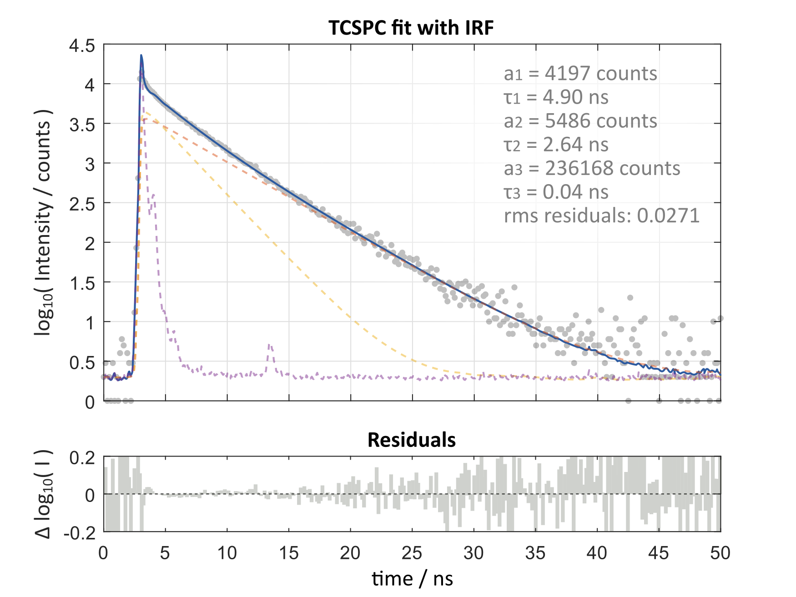

# TCSPC-fitting-with-IRF

Demonstration of fitting Time-Correlated Single Photon Counting (TCSPC) data with consideration of the Instrument Response Function (IRF).

# References

For further reading on TCSPC and IRF fitting see the following:

- Tesa et al., [_"Measurement of Photoluminescence lifetimes in the μs Range"_](https://www.edinst.com/wp-content/uploads/2018/06/TN_48-Measurement-of-Photoluminescence.pdf), Techical Note from Edinburgh Instruments, TN_P48, 31 May 2018

- Schönau et al., [_"Performing high speed lifetime measurements of proteins using a 280 nm picosecond laser"_](https://www.picoquant.com/images/uploads/page/files/19917/appnote_visuv_280_spectroscopy.pdf), Application Note from PicoQuant, 2019

- [TauFit](https://pam.readthedocs.io/en/latest/taufit.html) - TCSPC module of [PAM software](https://pam.readthedocs.io/en/latest/index.html)

- [_"What is Time-Correlated Single Photon Counting?"_](https://www.edinst.com/blog/what-is-tcspc/), Blog post from Edinburgh Instruments

- Wahl et al., [_"Time-Correlated Single Photon Counting"_](https://www.picoquant.com/images/uploads/page/files/7253/technote_tcspc.pdf), Technical Note from PicoQuant (2014)

- Léonard et al. [_"High-throughput Time-Correlated Single Photon Counting"_](https://www.doi.org/10.1039/C4LC00780H), Lab on a Chip, 14, 4338-4343, (2014) as well as the [Supplementary Information](http://www.rsc.org/suppdata/lc/c4/c4lc00780h/c4lc00780h1.pdf)

- O'Connor et al. [_"Deconvolution of fluorescence decay curves. A critical comparison of techniques"_](https://doi.org/10.1021/j100473a019), J. Phys. Chem., 83, 10, 1333–1343 (1979)

- Kalisz, Józef [_"Review of methods for time interval measurements with picosecond resolution"_](https://doi.org/10.1088/0026-1394/41/1/004), Metrologia 41 17 (2004)